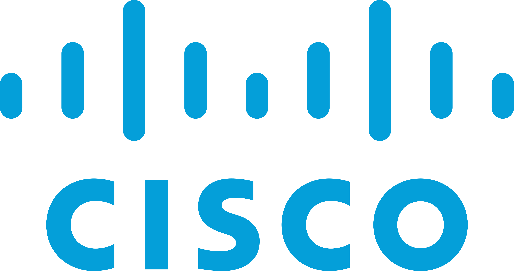

# Introduction 

     

Hello, I'm David Gichuru and welcome to my corner of the web. I'm a Web Developer and junior network engineer I'm passionate about tech and `love learning new things` I am a `detail-oriented` individual who takes pride in ensuring that every aspect of a task is carefully considered and executed to the best of my ability. I'm also a `team player` who thrives in a cooperative environment and a `quick learner` and always looking for new ways to improve my skills and knowledge.

# Interests

The Particular fields of tech I'm interested in are as follows

## 1. CyberSecurity 

This is what got me into tech. I stumbled upon some videos on YouTube where I saw security professionals doing some pretty interesting things with the browser and the Kali Linux command line and I was sold. At the time I did'nt know what they were doing but I knew I eventually wanted to do it :smile:

 

### These are my acheivements so far:

  

 

### My Prefered Learning PLatforms

 &nbsp; 
`Kali Linux` - The most preffered pentesting linux distro

 &nbsp; 
`Parrot OS` - My preffered pentesting linux distro

 &nbsp; 
`Hack The Box` - A platform full of machines to attack and learn from as well as competitions

 &nbsp; 
`PortSwigger` - A platform for learning and practicing web security

 &nbsp; 
`TryHackMe` - A platform for learning and practicing security concepts

 &nbsp; 
`Pico CTF` - A platform full of CTF challenges from beginner to advanced

 &nbsp;
`Cisco` - A learning platform to learn networking, linux, cybersecurity and more

[Try hack Me](https://tryhackme.com/) and [Hack The Box](https://www.hackthebox.com/) have really taught me alot and the best part is, I'm not done learning.

### Tools That I am very comfortable using

 &nbsp; `Wireshark` - For network analysis

 &nbsp; `Nmap` - For recon enumerating networks

 &nbsp; `Burpsuite` - For learning web security

## 2. Networking

I developed an interest for networking as soon as I first learned about basic web protocols. Since then I decided to explore the world of networking with Cisco and took a CCNA course and earned some credetials along the way.

 

&nbsp; &nbsp; &nbsp;
 &nbsp; &nbsp; &nbsp;
 &nbsp; &nbsp; &nbsp;
	   	

## 3. Web Development 
I really like the web and want to make some of the most beautiful websites in existence. I enjoy `front-end development` and warming up to backend development. I have a number of completed projects and solved challenges that you can view and learn from. Just make sure to attempt the challenge before taking a look at how I solved it :wink:

 

## My Prefered Languages, Frameworks and Libraries

 &nbsp; `HTML` - for structure

 &nbsp; `CSS` - for making things pretty

 &nbsp; `JavaScript` - for making dynamic websites and web apps

 &nbsp; `React JS` - beacause of it's modular approach to building user interfaces and code reusability

 &nbsp; `Bootstrap` - for quick styling

 &nbsp; `SQL` - for databases

 &nbsp; `Electron JS` - for taking the web to the desktop environment

 &nbsp; `Python` - For scripting

 

### My Tools

 &nbsp; `VS Code` - Because it is lightweight, easy to use and has a wealth of extensions that improve the developer exeprience

 &nbsp; `Node JS` - This provides a runtime for running JavaScript applications

 &nbsp; `Vite` - This is a really handy tool for scaffolding, developing and bundling web applications quickly and painlessly. It gets everything up and running really quickly

 &nbsp; `Figma` - This design tool helps me view designs and make some of my own so that my front-end applications can look as best as possible.

 &nbsp; `Lunacy` - This compliments Figma by giving me access to features figma doesn't  have like offline editing and viewing

 `Git` - For version controll

## Follow my progress

- Frontend Mentor - [dxiDavid](https://www.frontendmentor.io/profile/dxiDavid)
- Codewars - [dxiGichuru](https://www.codewars.com/users/dxiGichuru)
- X (Twitter) - [@dxidavid254](https://www.twitter.com/dxidavid254)
- Credly - [David Gichuru](https://www.credly.com/users/david-gichuru.7f767a1d)