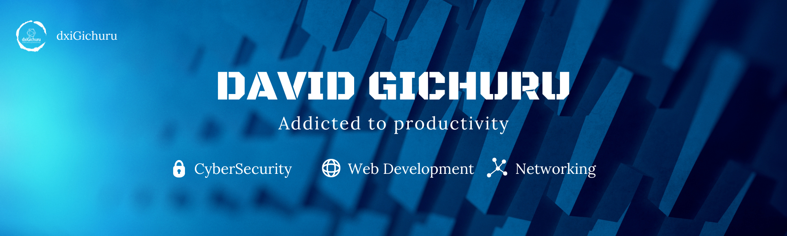
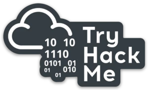
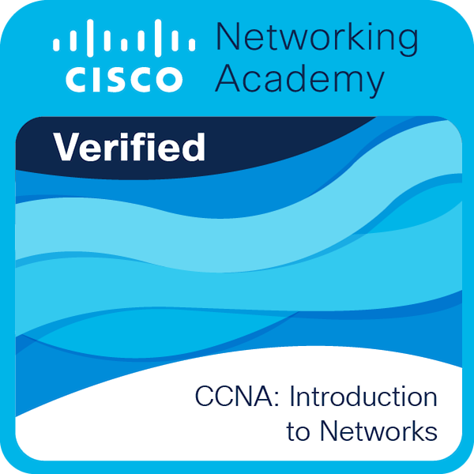
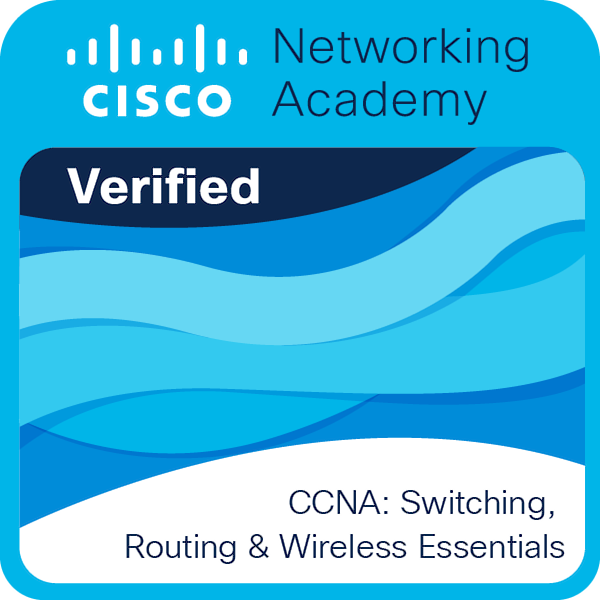
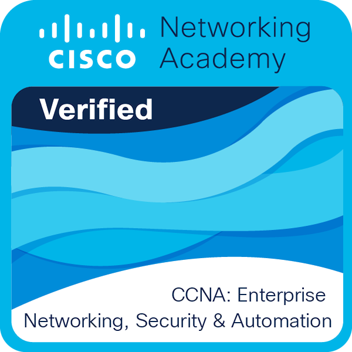
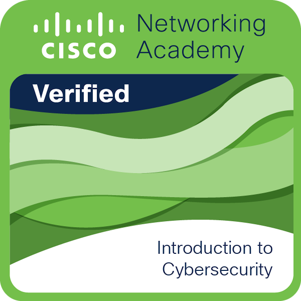

Hello, I'm David Gichuru. I'm passionate about tech and `love learning new things` and always looking for new ways to improve my skills and knowledge. I am a `detail-oriented` individual who takes pride in ensuring that every aspect of anything I do is carefully considered and executed to the best of my ability.

# Interests

The Particular fields of tech I'm interested in are as follows

## CyberSecurity 

This is what got me into tech. I stumbled upon some videos on YouTube where I saw security professionals doing some pretty interesting things with the browser and the Kali Linux command line and I was sold. At the time I did'nt know what they were doing but I knew I eventually wanted to do it :smile:

### My weapons of choice
 &nbsp;
 &nbsp;
 &nbsp;
 &nbsp;

[Try hack Me](https://tryhackme.com/) and [Hack The Box](https://www.hackthebox.com/) have really taught me alot and the best part is, I'm not done learning.

## Networking

I developed an interest for networking as soon as I first learned about basic web protocols. Since then I decided to explore the world of networking with Cisco and took a CCNA course and earned some credetials along the way

 

&nbsp; &nbsp; &nbsp;
 &nbsp; &nbsp; &nbsp;
 &nbsp; &nbsp; &nbsp;

## Web Development 
I really like the web and want to make some of the most beautiful websites in existence. I enjoy `front-end development` more than backend development.

### Languages, Frameworks and Libraries

 &nbsp;
 &nbsp;
 &nbsp;
 &nbsp;
 &nbsp;

### My Tools

 &nbsp;
 &nbsp;
 &nbsp;
 &nbsp;
 &nbsp;

## Follow my progress

- Frontend Mentor - [@dxiDavid](https://www.frontendmentor.io/profile/dxiDavid)
- Twitter - [@dxidavid254](https://www.twitter.com/dxidavid254)
- Credly - [David Gichuru](https://www.credly.com/users/david-gichuru.7f767a1d)